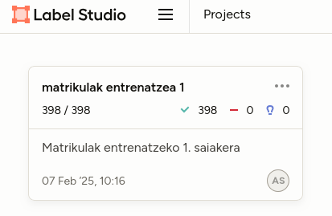
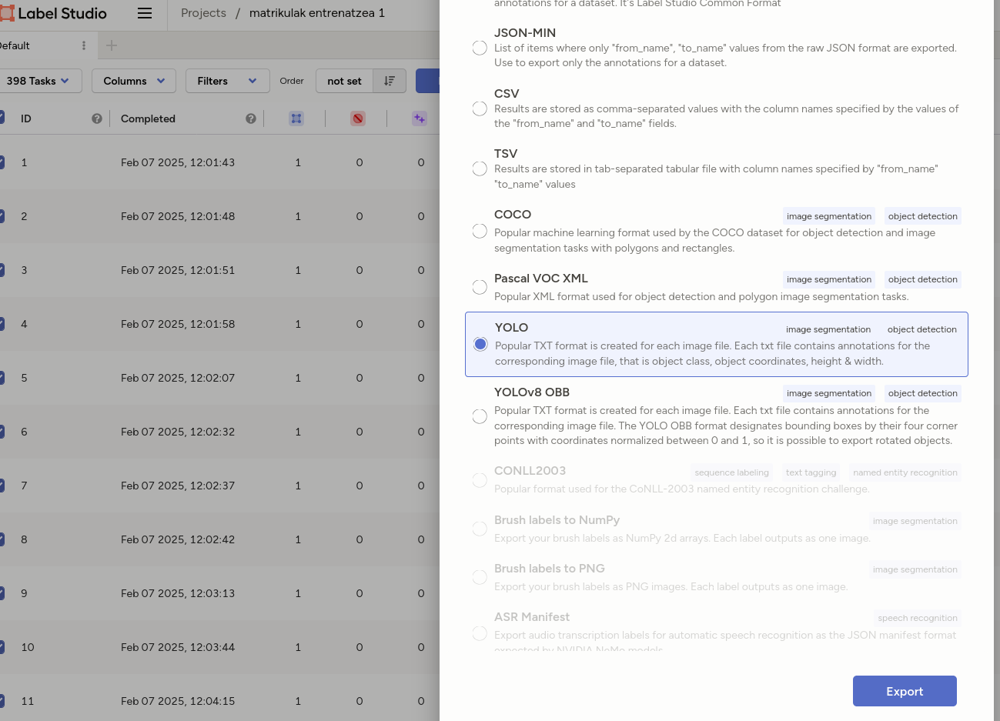
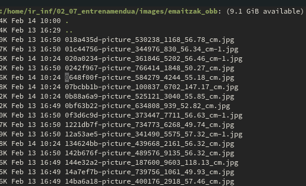

## Informazioa prozesatzea
Ubuntu zerbitzari instalazio batetik habiatuta, YOLOV8 modeloa erabiliz argazkien predikzioak egiteko ondorengo pausoak jarraitu behar dira.
Lehenengo eta behin, beharrezkoak diren pakete pare bat instalatu eta python ingurune bat sortu beharko dugu. Ingurunea sortzearen arrazoia, ``pip`` komandoaren erabilera da. Instalazio berrietan pythonen paketeak instalatzeko ingurune kontrolatuak sortzeko gomendia bultzatzen da:


```bash { lineNos=inline tabWidth=2}
sudo apt-get install -y libgl1-mesa-dev
sudo apt-get install -y libglib2.0-0
sudo apt install python3.12-venv
python3 -m venv .venv/

.venv/bin/pip install ultralytics
.venv/bin/pip install imutils
```


Ondorengo python kodeak, direktorio batean dauden argazkiak aztertu eta obketu detekzioa aplikatuko die, CSV batean emaitzak hutsiz.
Kode guztia [github.com/azku/txirrindularitza](https://github.com/azku/txirrindularitza) URLan aurkitu daiteke.


## Dokumentuak Igotzea
Probatzen gabiltzan gailuek, wifi sarera konektatzeko dauketen zailtasuna dela eta, hasierako bertsio baterako datuak webgune baten bitartez igotzea proposatu dugu.
Horretarako OVHCloud plataforman zerbitzari bat jarri dugu Ubuntu 24.04 Sistema Eragile batekin instalaturik.

Bertan Docker kontainerrak erabilita, Wordpress webgune bat ezarriko dugu eta hau editatu bertan fitxategiak igo ahal izateko.

Webgunea http://fptxurdinaga.in:8080/ helbidean jarri da eskuragarri.

Worpressen **Contact Form 7**, **Drag and Drop Multiple File Upload - Contact Form 7** eta **Flamingo**  pluginak instalatu dira fitxategiak zerbitzarira web bitartez igotzeko.
Lehenengo 2 pluginak Wordpressen inprimakiak sortzeko eta fitxategi anitz batera igotzeko aukera izateko erabili dira. Flamingo inprimaki bidalketa guztiak gordeta izateko erabili da.

## Worpressetik (Docker) datuak ateratzea
Datuak bi fasetan aterako dira. Alde batetik, iruadiak eskuz aterako dira docker komandoak erabilita.

```bash { lineNos=inline tabWidth=2}
docker cp wordpress:/var/www/html/wp-content/uploads/wp_dndcf7_uploads/wpcf7-files/*.png data/
```

Metadatuak, Flamengok Mysql datu-basean gordetzen ditu, eta hauek argazki fisikoekin lotzeko, python funtzio bat sortu da. Aurrez aipatu den bezala, kode guztia [github.com/azku/txirrindularitza](https://github.com/azku/txirrindularitza) URLan aurkitu daiteke. Fitxategi hau ``argazkien_metadatoak_ekarri.py`` deitzen da.

## Datuei begirada
Prozesamenduak emaitza bezala eskaintzen duen fitxategia estatistikoki interpretatzeko, Metabase sistema bat instalatu da. Sistema horretara CSV fitxategia inportatu eta aztertu daiteke.

Metabase martxan jartzeko Docker Compose erabili dugu. Hona hemen fitxategia:

```yaml { lineNos=inline tabWidth=2}
services:
  metabase:
    image: metabase/metabase:latest
    container_name: metabase
    hostname: metabase
    volumes:
      - /dev/urandom:/dev/random:ro
    ports:
      - 3000:3000
    environment:
      MB_DB_TYPE: postgres
      MB_DB_DBNAME: metabaseappdb
      MB_DB_PORT: 5432
      MB_DB_USER: metabase
      MB_DB_PASS: mysecretpassword
      MB_DB_HOST: postgres
    networks:
      - metanet1
    healthcheck:
      test: curl --fail -I http://localhost:3000/api/health || exit 1
      interval: 15s
      timeout: 5s
      retries: 5
  postgres:
    image: postgres:latest
    container_name: postgres
    hostname: postgres
    environment:
      POSTGRES_USER: metabase
      POSTGRES_DB: metabaseappdb
      POSTGRES_PASSWORD: mysecretpassword
    networks:
      - metanet1
networks:
  metanet1:
    driver: bridge
```

## Yolov modeloak hasierako emaitzak 
Yolov modelo gordinak lehenengo pausoko argazkietan nahiko emaitza onak lortzen ditu. Autobusak, kotxeak eta kamioiak estatistikoki bereiztea lortzen ditu.

## Matrikulak
Oinarrizko modeloetan ez dator matrikula identifikaziorako ahalmenik. Horretarako modeloa espezifikoki entrenatu beharra dago. Proiektuan zehar hainbat saiakera desberdin egin ditugu:
### 1. Saiakera
[Ondorengo web orrialdean](https://github.com/Ammar-Abdelhady-ai/Licence-Plate-Detection-and-Recognition-using-YOLO-V8) adierazitako pausoak jarraituz, hasierako 20 argazkirekin burututako entrenamenduak ez digu emaitza onik eskeini. YOLO modeloen entrenamenduari buruz sakondutakoan, argazki kopurua handiagoa izan behar dela ondorioztatu dugu.

### 2. Saiakera

#### Entrenamendurako prestaketa
Ikusmen konputazionalerako modeloan entrenatu ahal izateko, sarrera datu multzo bat prestatu beharra dago egitura jakin batean. Alde batetik entrenamendurako argazkiak izango ditugu non identifikatu nahi diren etiketak aurre identifikatuta egongo diren eta bounding box delakoekin inguratuta.
Ondoren test direktorio bat izango dugu. Egitura bera baina argazki gutxiago egongo dira hemen. Modeloak entrenamendua ikasi duenean, probak egiteko erabiliko du hau.

Egitura hau sortzeko **Label Studio** erabiltzea erabaki dugu. Hasieran 398 argazki inportatu ditugu eta banan banan ekuz anotatu.



Label Studiok, badauka YOLOVek behar dituen formatuan datuak esportatzeko aukera. Aukera hori baliatuz, irudien direktorio bat eta anotazioen direktorio bat sortzen ditu.



Entrenamendurako ordea, 3 direktorioko bikotetan (anotazioak eta irudiak) banatu behar dira. Horretarako python programatxo bat erabili dugu.

```python
    # Load exported data
    txts = glob(DATA_PATH + '/**/*.txt')
    images = glob(DATA_PATH + '/**/*.jpg') + glob(DATA_PATH + '/**/*.png')

    # Create DataFrame
    df = pd.DataFrame({'txt': txts, 'image': images})

    # Shuffle and split data
    df = df.sample(frac=1, random_state=42).reset_index(drop=True)
    train_size = int(0.8 * len(df))
    train_df = df.iloc[:train_size]
    test_df = df.iloc[train_size:]
    val_df = test_df.sample(frac=0.5)
    test_df = test_df.drop(val_df.index)

    # Create directories
    for split in ['train', 'test', 'val']:
        os.makedirs(f'{TRAINING_PATH}/{split}/images', exist_ok=True)
        os.makedirs(f'{TRAINING_PATH}/{split}/labels', exist_ok=True)

    # Copy files to respective directories
    for split, split_df in [('train', train_df), ('test', test_df), ('val', val_df)]:
        for _, row in split_df.iterrows():
            shutil.copy(row['image'], f'{TRAINING_PATH}/{split}/images')
            shutil.copy(row['txt'], f'{TRAINING_PATH}/{split}/labels')
```
Behin train, test eta val direktoriotan dena banatuta dagoela ``data.yaml`` fitxategia sortu dugu ondorengo edukiarekin:

``` yaml
train: ../train/images
val: ../val/images
test: ../test/images

nc: 1
names: ['matrikula']
    
```

### Kutxa orientatuak - Oriented Bounding Box (OBB) Model
Matrikulak entrenatzerakoan, irudi asko argertzen diran non matrikula inguratzen duen kutxa optimoa biratuta egongo litzatekeena.
Bilaketa burutu ostean Yolov8 OBB entrenatzeko aukera aztertu da. Horretarako programa guztia aldatu behar izan da.

Frogak burutu ostean, emaitza onak lortu dira eta beraz OBB ereduarekin jarraitzea proposatzen da. Kontutan hartu behar da detekzioak exekutatu diren irudi sorta, entrenamenduko bera dela.



### Inoiz ikusi gabeko argazkiekin programa probatu

### Estatistikak bildu

### Dena txukundu
